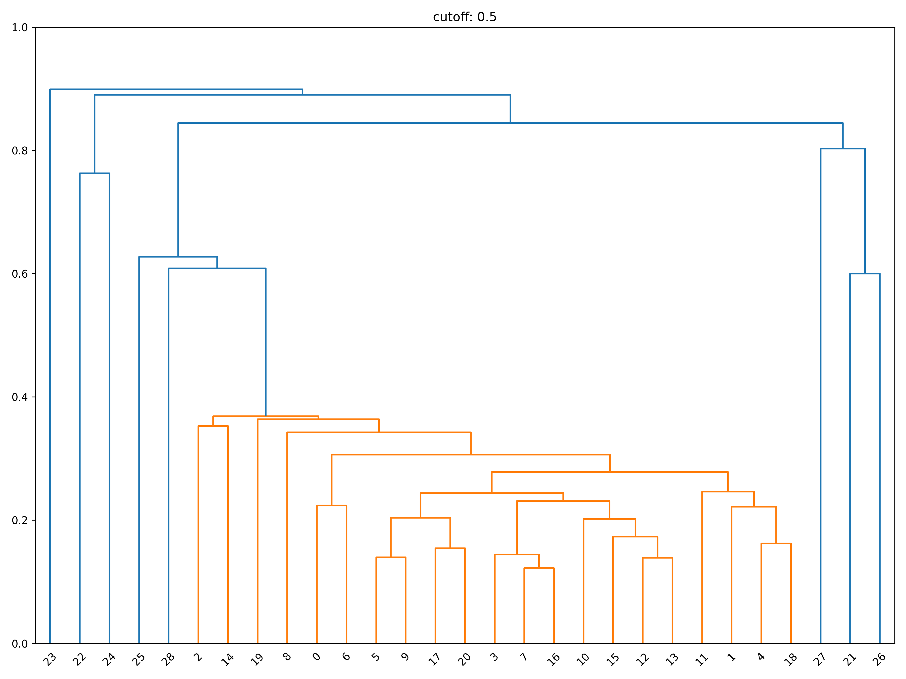
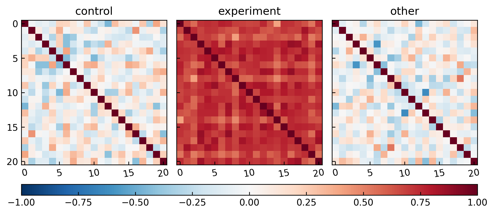
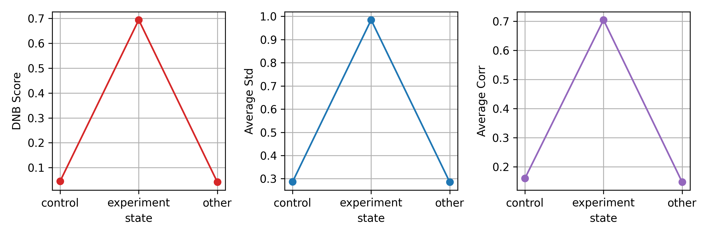

## $deneb
denebは2段階法によるDNB解析を行うためのCLIツールです。

揺らぐ変数や、それらのネットワークを手軽に抽出することを目的としています。

## 実行環境
- Python 3.10
- poetry

## かんたんな実行例
```bash
docker pull byeron/poetry

# カレントディレクトリをマウントしてコンテナを起動
docker run -it --rm -v $(pwd):/workspace byeron/poetry bash

# コンテナ内で以下のコマンドを実行
cd workspace
poetry install

# ヘルプの表示
poetry run python src/serve.py --help

# テストデータを登録
poetry run python src/serve.py file add testdata/test_table.csv
FILE_ID=c1b64a70
CTRL=control
EXPR=experiment

# 揺らぐ変数の抽出
poetry run python src/serve.py fluctuation $FILE_ID ftest --control $CTRL --experiment $EXPR

# 揺らぐ変数間の非類似度、階層型クラスタリングの計算
poetry run python src/serve.py network $FILE_ID correlation --control $CTRL --experiment $EXPR
poetry run python src/serve.py network $FILE_ID clustering --control $CTRL --experiment $EXPR

# DNBスコアの計算
poetry run python src/serve.py dnb $FILE_ID score --control $CTRL --experiment $EXPR

# 樹形図、相関ヒートマップ、DNBスコアの可視化
poetry run python src/serve.py visualize $FILE_ID dendrogram
poetry run python src/serve.py visualize $FILE_ID heatmap
poetry run python src/serve.py visualize $FILE_ID score --state label1 --state label2 --state label3
```

## コマンド体系
最新のオプションは反映されていない可能性があります。最新のオプションは`--help`で確認してください。

```bash
# *: メインコマンド, **: サブコマンド, --: オプション
 deneb-alpha
 ├── dnb*
 │   ├── --alpha                    [default: 0.05]       # statistical significance
 │   ├── --threshold                [default: 2.0]        # threshold for fold change
 │   ├── --fluctuation-method       [default: ftest]      # method for fluctuation
 │   ├── --multiple-correction / --no-multiple-correction   [default: True]        # threshold for fold change
 │   ├── --multiple-correction-method      [default: fdr_bh]     # method for multiple testing correction
 │   ├── --dissimilarity-method     [default: pearson]    # method for dissimilarity
 │   ├── --dissimilarity-metric     [default: abslinear]  # metric for dissimilarity 
 │   ├── --clustering-cutoff        [default: 0.5]        # cutoff of dissimilarity
 │   ├── --clustering-rank          [default: 1]          # The Nth largest cluster
 │   ├── --clustering-linkage-method [default: average]   # linkage method
 │   ├── --clustering-criterion     [default: distance]   # criterion for clustering
 │   └── score**
 │       └── --state                [default: []]         # state labels
 ├── file*
 │   ├── add**
 │   ├── delete**
 │   └── get**
 ├── fluctuation*
 │   ├── --multiple-correction / --no-multiple-correction  [default: True]  # whether to use multiple testing correction
 │   ├── --method                    [default: fdr_bh]     # method for multiple testing correction
 │   ├── ftest**
 │   │   ├── --ctrl                  [default: control]    # control group label
 │   │   ├── --expr                  [default: experiment] # experiment group label
 │   │   ├── --alpha                 [default: 0.05]       # statistical significance
 │   │   └── --robust / --no-robust  [default: no-robust]  # whether to use robust statistics
 │   ├── inner-var**: 対象群なしDNB
 │   │   ├── --expr                  [default: experiment] # experiment group label
 │   │   ├── --threshold             [default: 2.0]        # threshold for fold change
 │   │   └── --robust / --no-robust  [default: no-robust]  # whether to use robust statistics
 │   ├── levene**
 │   │   ├── --ctrl                  [default: control]    # control group label
 │   │   ├── --expr                  [default: experiment] # experiment group label
 │   │   ├── --alpha                 [default: 0.05]       # statistical significance
 │   │   └── --robust / --no-robust  [default: no-robust]  # whether to use robust statistics
 │   └── var-ratio**
 │       ├── --ctrl                  [default: control]    # control group label
 │       ├── --expr                  [default: experiment] # experiment group label
 │       ├── --threshold             [default: 2.0]        # threshold for fold change
 │       └── --robust / --no-robust  [default: no-robust]  # whether to use robust statistics
 ├── network*
 │   ├── --alpha                     [default: 0.05]       # statistical significance
 │   ├── --fluctuation-method        [default: ftest]      # method for fluctuation
 │   ├── --multiple-correction / --no-multiple-correction  [default: True]  # whether to use multiple testing correction
 │   ├── --multiple-correction-method       [default: fdr_bh]     # method for multiple testing correction
 │   ├── clustering**
 │   │   ├── --ctrl                  [default: None]       # control group label
 │   │   ├── --expr                  [default: experiment] # experiment group label
 │   │   ├── --corr-method           [default: pearson]    # correlation method
 │   │   ├── --dissimilarity         [default: abslinear]  # metric for clustering
 │   │   ├── --cutoff                [default: 0.5]        # cutoff of dissimilarity
 │   │   ├── --rank                  [default: 1]          # The Nth largest cluster
 │   │   ├── --linkage-method        [default: average]    # linkage method
 │   │   └── --criterion             [default: distance]   # criterion for clustering
 │   └── correlation**
 │       ├── --ctrl                  [default: None]       # control group label
 │       ├── --expr                  [default: experiment] # experiment group label
 │       ├── --corr-method           [default: pearson]    # correlation method
 │       └── --dissimilarity         [default: abslinear]  # metric for clustering
 └── visualize*
     ├── dendrogram**
     │   ├── --cutoff                [default: 0.5]        # cutoff of dissimilarity
     │   └── --method                [default: average]    # linkage method
     ├── heatmap**
     └── score**
         └── --state                 [default: []]         # state labels
```

## 想定しているファイル形式
以下のようなテーブル構造をもつCSVファイルを想定しています。

|       | feat1 | feat2 | feat3 | ... | featN |
|-------|-------|-------|-------|-----|-------|
|label1 |       |       |       |     |       |
|label1 |       |       |       |     |       |
|label1 |       |       |       |     |       |
|label2 |       |       |       |     |       |
|label2 |       |       |       |     |       |
|label3 |       |       |       |     |       |

pandas.read_csv(index_col=0, header=0)によって、DataFrame.indexにサンプルID、DataFrame.columnsに変数名が格納されます。

具体的な例は`testdata`ディレクトリに練習用データとして格納しています。

## 出力例



